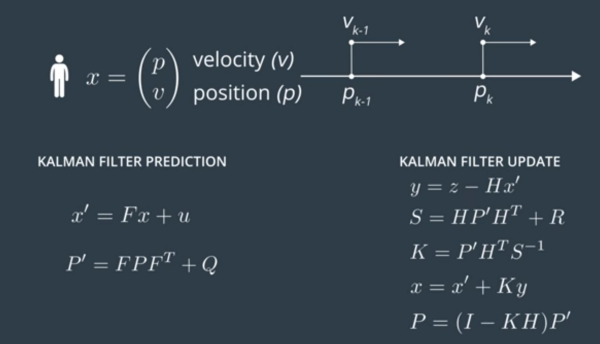
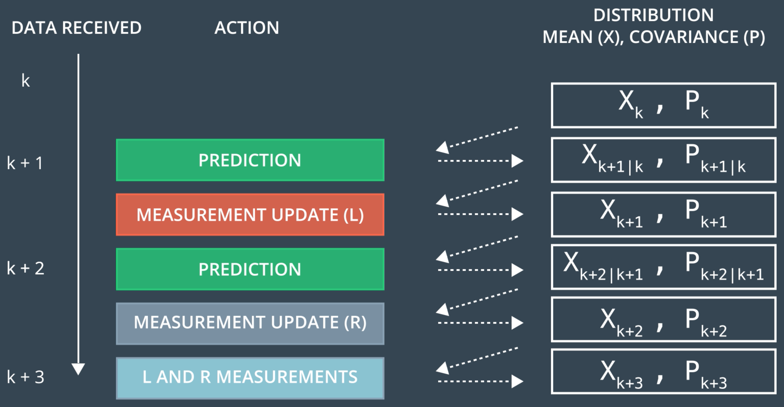
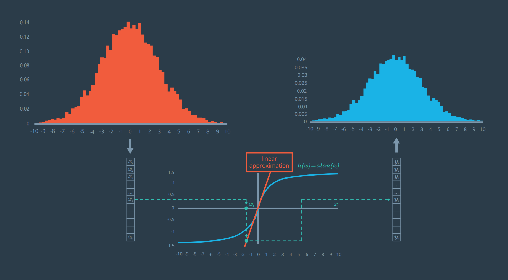
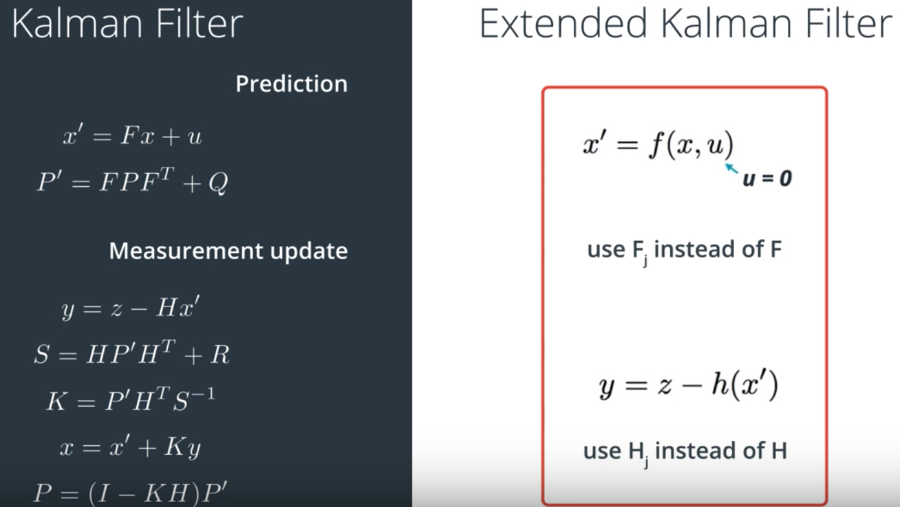
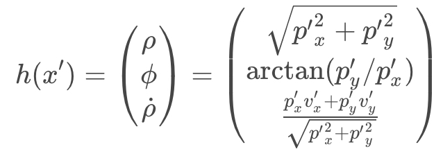
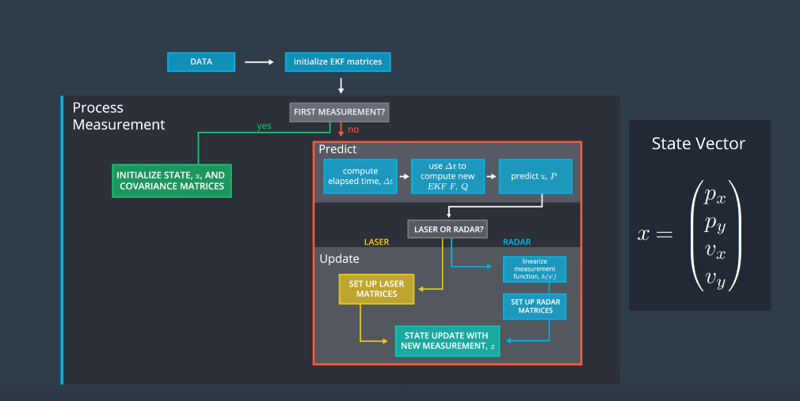

# Extended Kalman Filter Project 

### Self-Driving Car Engineer Nanodegree Program

# Introduction
This is an extended Kalman Filter implementation in C++ for fusing lidar and radar sensor measurements.
A Kalman filter can be used anywhere where you have uncertain information about some dynamic system, 
and you want to make an educated guess about what the system is going to do next. 

## Kalman Filter

This algorithm is a recursive two-step process: prediction, and update. The prediction step produces estimates of the current variables along with their uncertainties. These estimates are based on the assumed model of how the estimates change over time. The update step is done when the next measurements (subject to noise) is observed. In this step, the estimates (let’s call it state from here on) are updated based on the weighted average of the predicted state and the state based on the current measurement. A lower weight is given to that with a higher uncertainty.

**We want to predict our position, and how fast we are going in what direction at any point in time:**
- In essence: the position and velocity of the system in cartesian coordinates: `(x, y, vx, vy)`

Kalman filter algorithm can be roughly organized under the following steps:
1. We make a prediction of a state, based on some previous values and model.
2. We obtain the measurement of that state, from sensor.
3. We update our prediction, based on our errors
4. Repeat.

## Extended Kalman Filter

The extended Kalman filter (EKF) is a way of incorporating measurements from multiple sensors to make more robust estimations. It is able to deal with sensors presenting measurements in different dimensions.

In our case of tracking the position and velocity of an object, we could use laser or radar range sensors. 

**In this case, we have two 'noisy' sensors:**
- A lidar sensor that measures our position in cartesian-coordinates `(x, y)`
- A radar sensor that measures our position and relative velocity (the velocity within line of sight) in polar coordinates `(rho, phi, drho)`

However, while laser sensors represent measurements in cartesian coordinate, the radar sensors represent in polar coordinate. A direct conversion of polar coordinate to cartesian coordinate gives nonlinearity and so Kalman filter is not applicable any more as it works with Gaussian functions only.

We have to be able to linearly map from the polar coordinate to the cartesian coordinate.

One of the solution is to linearise the h(x) function and that’s the key of EKF.

EKF uses a method called First Order Taylor Expansion to obtain linear approximation of the polar coordinate measurements in the update.

In this process, a Jacobian matrix is produced, which represents the linear mapping from polar to cartesian coordinate, applied at the update step. Hence, the conversion matrix H becomes the Jacobian matrix Hj, while we will use non-linear state transition and measurement functions for both prediction and update respectively. 

It turns out that the Kalman Filter equations and EKF equations are very similar.

 

The main differences of EKF and KF are:

- The F matrix will be replaced by Fj​ when calculating P′.
- The H matrix in the Kalman filter will be replaced by the Jacobian matrix Hj​ when calculating S, K, and P.
- To calculate x′, the prediction update function, f, is used instead of the F matrix.
- To calculate y, the h function is used instead of the H matrix.

There are few drawbacks to EKF:

- It is difficult to calculate jacobians if they need to be found analytically.
- There is a high computational cost if the jacobians found numerically.
- EKF only works on the system that have a differentiable model.

Coming back to the measurement update Part we explained before. As Radar measurement is non-linear, we need to use EKF on Measurement Update cycle, but we can use the same formula in prediction cycle.

The H matrix from the laser measurement and h(x) equations from the radar measurement are actually accomplishing the same thing; they are both needed to solve y=z−Hx′ in the update step.

But for radar, there is no H matrix that will map the state vector x into polar coordinates; instead, you need to calculate the mapping manually to convert from cartesian coordinates to polar coordinates.

Here is the h function that specifies how the predicted position and speed get mapped to the polar coordinates of range, bearing and range rate.

Hence for radar y=z−Hx′ becomes y=z−h(x′).

The resulting EKF general flow and overview is :

The main program can be built and run by doing the following from the project top directory.

1. mkdir build
2. cd build
3. cmake ..
4. make
5. ./ExtendedKF

Here is the main protcol that main.cpp uses for uWebSocketIO in communicating with the simulator.

INPUT: values provided by the simulator to the c++ program

["sensor_measurement"] => the measurement that the simulator observed (either lidar or radar)

OUTPUT: values provided by the c++ program to the simulator

["estimate_x"] <= kalman filter estimated position x
["estimate_y"] <= kalman filter estimated position y
["rmse_x"]
["rmse_y"]
["rmse_vx"]
["rmse_vy"]

---

## Dependencies

* cmake >= 3.5
  * All OSes: [click here for installation instructions](https://cmake.org/install/)
* make >= 4.1 (Linux, Mac), 3.81 (Windows)
  * Linux: make is installed by default on most Linux distros
  * Mac: [install Xcode command line tools to get make](https://developer.apple.com/xcode/features/)
  * Windows: [Click here for installation instructions](http://gnuwin32.sourceforge.net/packages/make.htm)
* gcc/g++ >= 5.4
  * Linux: gcc / g++ is installed by default on most Linux distros
  * Mac: same deal as make - [install Xcode command line tools](https://developer.apple.com/xcode/features/)
  * Windows: recommend using [MinGW](http://www.mingw.org/)

## Basic Build Instructions

1. Clone this repo.
2. Make a build directory: `mkdir build && cd build`
3. Compile: `cmake .. && make` 
   * On windows, you may need to run: `cmake .. -G "Unix Makefiles" && make`
4. Run it: `./ExtendedKF `

